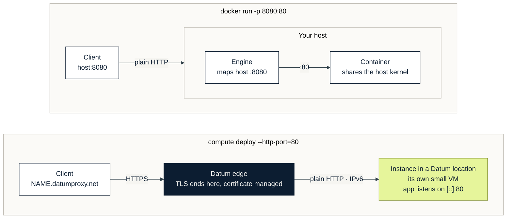

# Same command

Mermaid version of [01-same-command.png](01-same-command.png).

```mermaid
---
config:
  theme: base
  flowchart:
    wrappingWidth: 420
    padding: 14
    subGraphTitleMargin:
      top: 8
      bottom: 14
  themeVariables:
    fontFamily: "DejaVu Sans, Verdana, sans-serif"
    primaryColor: "#F6F5F1"
    primaryTextColor: "#0C1D31"
    primaryBorderColor: "#0C1D31"
    lineColor: "#2F3F48"
    clusterBkg: "#FBFAF7"
    clusterBorder: "#B9B5AC"
    labelBackground: "#F6F5F1"
    edgeLabelBackground: "#F6F5F1"
    mainBkg: "#F6F5F1"
---
flowchart TB
  subgraph DK["docker run -p 8080:80"]
    direction LR
    d0["Client<br/>host:8080"]:::white
    subgraph DH["Your host"]
      direction LR
      d1["Engine<br/>maps host :8080"]:::white
      d2["Container<br/>shares the host kernel"]:::white
      d1 -->|":80"| d2
    end
    d0 -->|"plain HTTP"| DH
  end
  subgraph DT["compute deploy --http-port=80"]
    direction LR
    t0["Client<br/>NAME.datumproxy.net"]:::white
    t1["Datum edge<br/>TLS ends here, certificate managed"]:::navy
    t2["Instance in a Datum location<br/>its own small VM<br/>app listens on [::]:80"]:::lime
    t0 -->|"HTTPS"| t1
    t1 -->|"plain HTTP · IPv6"| t2
  end
  DK ~~~ DT
  classDef navy fill:#0C1D31,stroke:#0C1D31,color:#F6F5F1
  classDef lime fill:#E6F59B,stroke:#7C8A2E,color:#0C1D31
  classDef white fill:#FFFFFF,stroke:#0C1D31,color:#0C1D31
  classDef cream fill:#F6F5F1,stroke:#8A8E99,color:#0C1D31
  classDef bad fill:#F7D4D2,stroke:#B5605E,color:#7A1F1A
  classDef good fill:#E6F59B,stroke:#5E6B1E,color:#0C1D31
```

*Same image, same port. A URL takes the place of the host port.*
