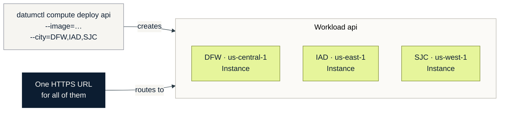

# Same command, more places

Mermaid version of [02-many-places.png](02-many-places.png).

```mermaid
---
config:
  theme: base
  flowchart:
    wrappingWidth: 420
    padding: 14
    subGraphTitleMargin:
      top: 8
      bottom: 14
  themeVariables:
    fontFamily: "DejaVu Sans, Verdana, sans-serif"
    primaryColor: "#F6F5F1"
    primaryTextColor: "#0C1D31"
    primaryBorderColor: "#0C1D31"
    lineColor: "#2F3F48"
    clusterBkg: "#FBFAF7"
    clusterBorder: "#B9B5AC"
    labelBackground: "#F6F5F1"
    edgeLabelBackground: "#F6F5F1"
    mainBkg: "#F6F5F1"
---
flowchart LR
  cmd["datumctl compute deploy api<br/>--image=…<br/>--city=DFW,IAD,SJC"]:::cream
  subgraph WL["Workload api"]
    direction TB
    i1["DFW · us-central-1<br/>Instance"]:::lime
    i2["IAD · us-east-1<br/>Instance"]:::lime
    i3["SJC · us-west-1<br/>Instance"]:::lime
  end
  url["One HTTPS URL<br/>for all of them"]:::navy
  cmd -->|"creates"| WL
  url -->|"routes to"| WL
  classDef navy fill:#0C1D31,stroke:#0C1D31,color:#F6F5F1
  classDef lime fill:#E6F59B,stroke:#7C8A2E,color:#0C1D31
  classDef white fill:#FFFFFF,stroke:#0C1D31,color:#0C1D31
  classDef cream fill:#F6F5F1,stroke:#8A8E99,color:#0C1D31
  classDef bad fill:#F7D4D2,stroke:#B5605E,color:#7A1F1A
  classDef good fill:#E6F59B,stroke:#5E6B1E,color:#0C1D31
```

*One command, one Workload, one Instance in each city, one URL.*
