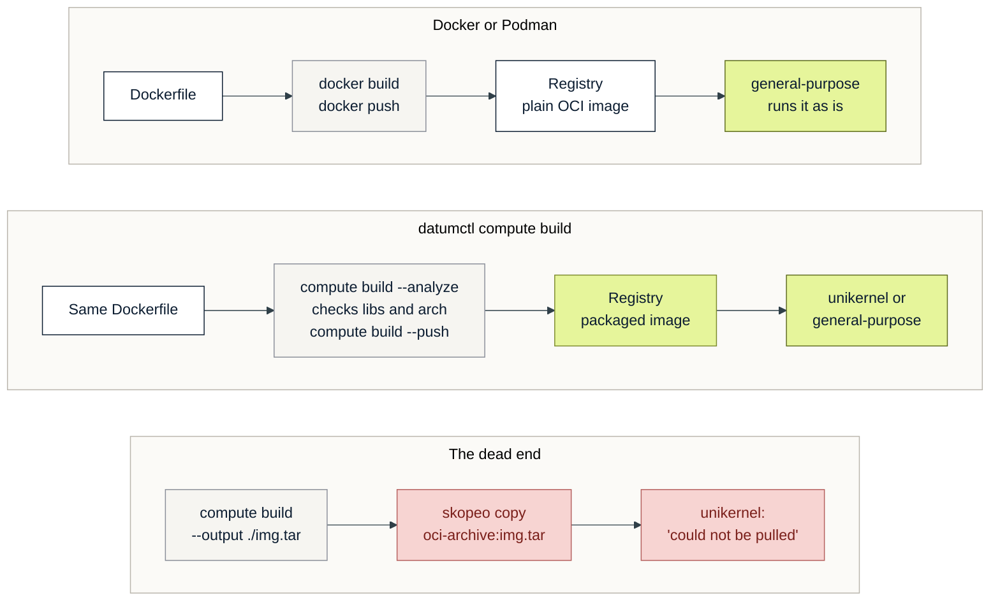

# Same Dockerfile

Mermaid version of [03-build-push.png](03-build-push.png).

```mermaid
---
config:
  theme: base
  flowchart:
    wrappingWidth: 420
    padding: 14
    subGraphTitleMargin:
      top: 8
      bottom: 14
  themeVariables:
    fontFamily: "DejaVu Sans, Verdana, sans-serif"
    primaryColor: "#F6F5F1"
    primaryTextColor: "#0C1D31"
    primaryBorderColor: "#0C1D31"
    lineColor: "#2F3F48"
    clusterBkg: "#FBFAF7"
    clusterBorder: "#B9B5AC"
    labelBackground: "#F6F5F1"
    edgeLabelBackground: "#F6F5F1"
    mainBkg: "#F6F5F1"
---
flowchart TB
  subgraph A["Docker or Podman"]
    direction LR
    a0["Dockerfile"]:::white --> a1["docker build<br/>docker push"]:::cream --> a2["Registry<br/>plain OCI image"]:::white --> a3["general-purpose<br/>runs it as is"]:::good
  end
  subgraph B["datumctl compute build"]
    direction LR
    b0["Same Dockerfile"]:::white --> b1["compute build --analyze<br/>checks libs and arch<br/>compute build --push"]:::cream --> b2["Registry<br/>packaged image"]:::lime --> b3["unikernel or<br/>general-purpose"]:::good
  end
  subgraph C["The dead end"]
    direction LR
    c0["compute build<br/>--output ./img.tar"]:::cream --> c1["skopeo copy<br/>oci-archive:img.tar"]:::bad --> c2["unikernel:<br/>'could not be pulled'"]:::bad
  end
  A ~~~ B
  B ~~~ C
  classDef navy fill:#0C1D31,stroke:#0C1D31,color:#F6F5F1
  classDef lime fill:#E6F59B,stroke:#7C8A2E,color:#0C1D31
  classDef white fill:#FFFFFF,stroke:#0C1D31,color:#0C1D31
  classDef cream fill:#F6F5F1,stroke:#8A8E99,color:#0C1D31
  classDef bad fill:#F7D4D2,stroke:#B5605E,color:#7A1F1A
  classDef good fill:#E6F59B,stroke:#5E6B1E,color:#0C1D31
```

*Any image runs on general-purpose. `datumctl compute build` packages it for unikernel too.*
